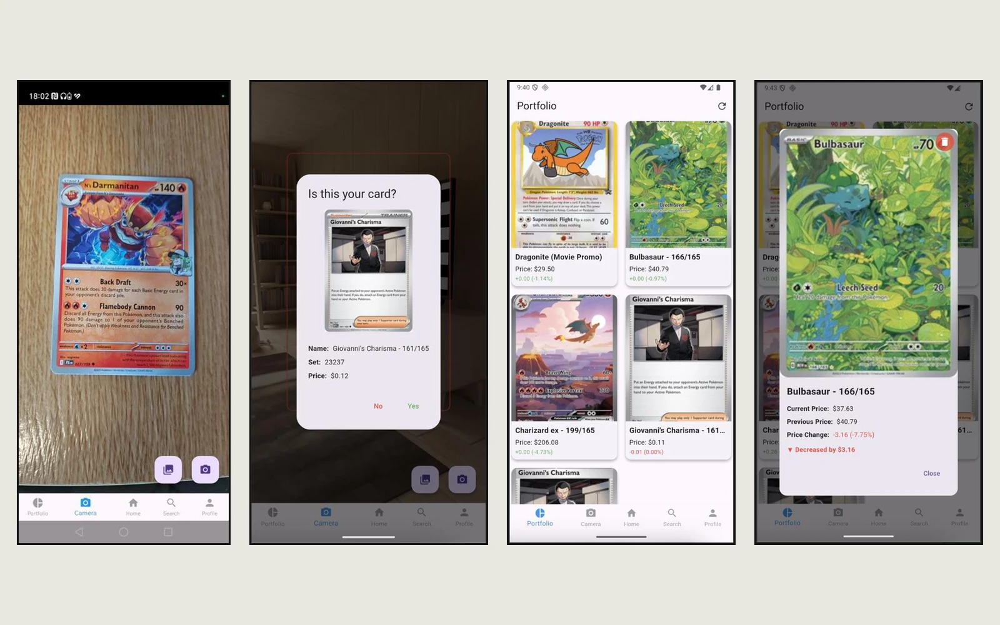
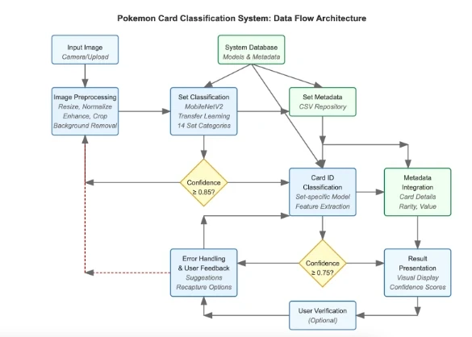
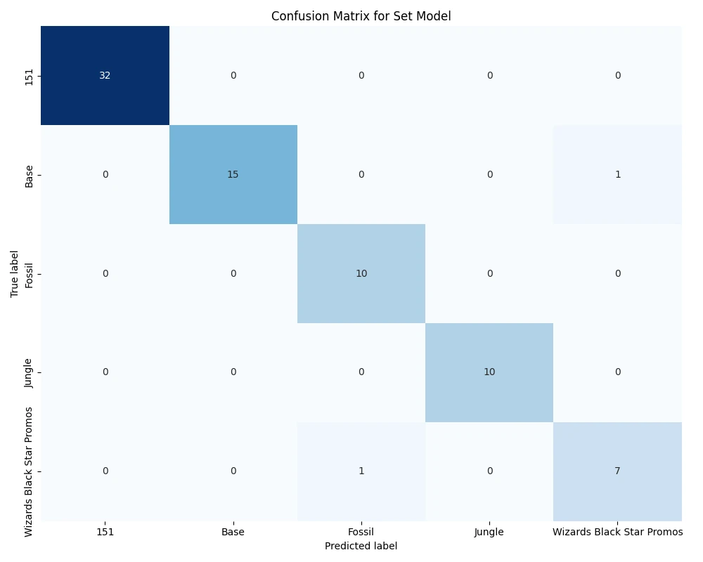
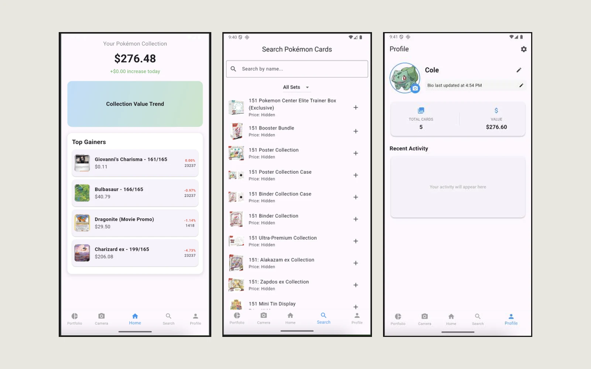

# Pokémon Card Scanner

Point your phone at a Pokémon card and the app identifies it, looks up what it's worth today, and adds it to your collection. Two image-recognition models run on the phone itself, and prices come from live market data.

This was my BSc Computer Science dissertation at the University of Lincoln (October 2024 to May 2025): *Pokémon TCG Scanner Application: Exploring Transfer Learning in AI for Real-time Card Identification and Market Price Analysis.*




---

## The problem

A collection can run to hundreds of cards whose value changes week to week, and pricing it means searching for every card one at a time. The app turns that into a single step: photograph the card, confirm what it is, and it joins a collection that keeps its own prices up to date.

---

## What I built

- **Scan a card.** Line the card up inside the outline and take the photo. Whatever is inside the outline is exactly what gets captured, with no surprise cropping or zoom.
- **Confirm before saving.** Recognition is a best guess, so the app shows the card it thinks you scanned, with its set and price, and asks before adding it.
- **A collection that shows movement.** Every card shows its current price and how far it moved since the last refresh, in green or red. Pull down to refresh prices.
- **Home, search and profile.** The home screen leads with the collection's total value and the biggest movers, search covers cards and sealed products, and the profile keeps a running count of cards and value.
- **Dark mode and a consistent theme** across every screen.

---

## How the recognition works

Rather than one model choosing between hundreds of near-identical cards, the work is split in two:

1. A **set model** answers "which set is this card from?"
2. A **card model** for that set answers "which card is it?"

Both start from MobileNetV2, a model already trained to understand images in general, and are retrained on 488 card designs from five sets (151, Base, Jungle, Fossil and Wizards Black Star Promos). That approach is called transfer learning. A confidence check after each model means a blurry photo gets a retake prompt instead of a wrong answer.



### Results

| | |
|---|---|
| Set model accuracy | 97.4% |
| Card model | All 488 test cards identified |
| Model size after TensorFlow Lite conversion | Roughly half, for at most 1 to 2% accuracy |
| Training on rotated and darkened copies | About 6% better on unseen photos |



The two misses in the set model are both between older Wizards-era sets that share a look.

### A trade-off made on purpose

The card model originally predicted rarity too, but that extra output broke the model when it was converted to run on the phone. I removed it, kept everything working on-device, and documented the decision in the dissertation.

---

## Stack

| Layer | Technology |
|---|---|
| App | Flutter and Dart |
| Recognition | TensorFlow and Keras (MobileNetV2), converted to TensorFlow Lite |
| On-device inference | tflite_flutter |
| Storage | SQLite (sqflite) |
| Prices | TCGplayer data via tcgcsv.com |
| Camera | camera, image_picker, image_cropper |

---

## Running it locally

You'll need [Flutter](https://docs.flutter.dev/get-started/install) and an Android device or emulator.

```bash
git clone https://github.com/Cole-Crawley/pokemon-card-scanner.git
cd pokemon-card-scanner
flutter pub get
flutter run
```

The trained models are included in `assets/models/`, one set model plus one card model per set.

---

## Project structure

```
lib/
  main.dart
  screens/        Camera, home, portfolio, search, profile and settings
  services/       TensorFlow Lite helper, SQLite database, theme
  models/         Card model
  widgets/        Pull-to-refresh wrapper
assets/
  models/         The six .tflite models and their labels
  test_images/    Sample cards for testing
```

---

## Screenshots

Home, search and profile:



*Made by [Cole Crawley](https://colecrawley.vercel.app).*
